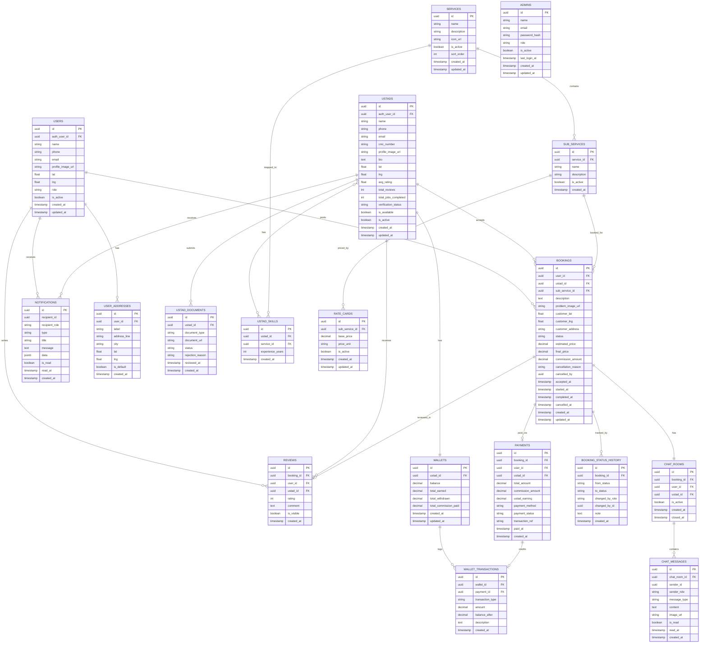

# Database Design

# Ustad Online — PostgreSQL (Neon Serverless)

> **Version:** 1.0
> **Date:** 2026-10-09
> **Database:** PostgreSQL 16+ (Neon Serverless)
> **Auth Schema:** `neon_auth` (managed by Neon Better Auth)

---

## 1. Entity Relationship Diagram (ER Diagram)



---

## 2. Enum Definitions

```sql
-- User roles
CREATE TYPE user_role AS ENUM ('customer', 'ustad', 'admin');

-- Ustad verification status
CREATE TYPE verification_status AS ENUM ('pending', 'under_review', 'verified', 'rejected');

-- Document types
CREATE TYPE document_type AS ENUM ('cnic_front', 'cnic_back', 'skill_certificate', 'experience_letter');

-- Document review status
CREATE TYPE document_status AS ENUM ('pending', 'approved', 'rejected');

-- Booking status
CREATE TYPE booking_status AS ENUM ('pending', 'accepted', 'in_progress', 'completed', 'paid', 'cancelled', 'expired');

-- Payment method
CREATE TYPE payment_method AS ENUM ('cash', 'easypaisa', 'jazzcash');

-- Payment status
CREATE TYPE payment_status AS ENUM ('pending', 'completed', 'failed', 'refunded');

-- Wallet transaction type
CREATE TYPE transaction_type AS ENUM ('credit', 'debit', 'withdrawal', 'commission');

-- Chat message type
CREATE TYPE message_type AS ENUM ('text', 'image', 'system');

-- Notification type
CREATE TYPE notification_type AS ENUM (
  'new_booking_request',
  'booking_accepted',
  'booking_rejected',
  'booking_cancelled',
  'booking_completed',
  'payment_received',
  'review_received',
  'kyc_approved',
  'kyc_rejected',
  'new_message',
  'system_announcement'
);

-- Price unit
CREATE TYPE price_unit AS ENUM ('fixed', 'per_hour', 'per_visit');

-- Admin role
CREATE TYPE admin_role AS ENUM ('super_admin', 'moderator');
```

---

## 3. Table Definitions (DDL)

### 3.1 Users Table

```sql
CREATE TABLE users (
  id UUID PRIMARY KEY DEFAULT gen_random_uuid(),
  auth_user_id UUID UNIQUE NOT NULL,       -- Reference to neon_auth.users
  name VARCHAR(100) NOT NULL,
  phone VARCHAR(20) UNIQUE NOT NULL,
  email VARCHAR(150) UNIQUE,
  profile_image_url TEXT,
  lat DOUBLE PRECISION,
  lng DOUBLE PRECISION,
  role user_role NOT NULL DEFAULT 'customer',
  is_active BOOLEAN NOT NULL DEFAULT true,
  created_at TIMESTAMPTZ NOT NULL DEFAULT NOW(),
  updated_at TIMESTAMPTZ NOT NULL DEFAULT NOW()
);
```

### 3.2 Ustads Table

```sql
CREATE TABLE ustads (
  id UUID PRIMARY KEY DEFAULT gen_random_uuid(),
  auth_user_id UUID UNIQUE NOT NULL,       -- Reference to neon_auth.users
  name VARCHAR(100) NOT NULL,
  phone VARCHAR(20) UNIQUE NOT NULL,
  email VARCHAR(150) UNIQUE,
  cnic_number VARCHAR(15) UNIQUE,
  profile_image_url TEXT,
  bio TEXT,
  lat DOUBLE PRECISION,
  lng DOUBLE PRECISION,
  avg_rating DECIMAL(2,1) DEFAULT 0.0,
  total_reviews INTEGER DEFAULT 0,
  total_jobs_completed INTEGER DEFAULT 0,
  verification_status verification_status NOT NULL DEFAULT 'pending',
  is_available BOOLEAN NOT NULL DEFAULT false,
  is_active BOOLEAN NOT NULL DEFAULT true,
  created_at TIMESTAMPTZ NOT NULL DEFAULT NOW(),
  updated_at TIMESTAMPTZ NOT NULL DEFAULT NOW()
);
```

### 3.3 Ustad Documents Table

```sql
CREATE TABLE ustad_documents (
  id UUID PRIMARY KEY DEFAULT gen_random_uuid(),
  ustad_id UUID NOT NULL REFERENCES ustads(id) ON DELETE CASCADE,
  document_type document_type NOT NULL,
  document_url TEXT NOT NULL,              -- Cloudinary URL
  status document_status NOT NULL DEFAULT 'pending',
  rejection_reason TEXT,
  reviewed_at TIMESTAMPTZ,
  created_at TIMESTAMPTZ NOT NULL DEFAULT NOW()
);
```

### 3.4 Ustad Skills Table

```sql
CREATE TABLE ustad_skills (
  id UUID PRIMARY KEY DEFAULT gen_random_uuid(),
  ustad_id UUID NOT NULL REFERENCES ustads(id) ON DELETE CASCADE,
  service_id UUID NOT NULL REFERENCES services(id) ON DELETE CASCADE,
  experience_years INTEGER DEFAULT 0,
  created_at TIMESTAMPTZ NOT NULL DEFAULT NOW(),
  UNIQUE(ustad_id, service_id)            -- One ustad can have one entry per service
);
```

### 3.5 User Addresses Table

```sql
CREATE TABLE user_addresses (
  id UUID PRIMARY KEY DEFAULT gen_random_uuid(),
  user_id UUID NOT NULL REFERENCES users(id) ON DELETE CASCADE,
  label VARCHAR(50) NOT NULL,              -- 'home', 'office', 'other'
  address_line TEXT NOT NULL,
  city VARCHAR(100) DEFAULT 'Faisalabad',
  lat DOUBLE PRECISION NOT NULL,
  lng DOUBLE PRECISION NOT NULL,
  is_default BOOLEAN NOT NULL DEFAULT false,
  created_at TIMESTAMPTZ NOT NULL DEFAULT NOW()
);
```

### 3.6 Services Table

```sql
CREATE TABLE services (
  id UUID PRIMARY KEY DEFAULT gen_random_uuid(),
  name VARCHAR(100) UNIQUE NOT NULL,       -- 'Electrician', 'Plumber', 'AC Technician'
  description TEXT,
  icon_url TEXT,                           -- Cloudinary URL for service icon
  is_active BOOLEAN NOT NULL DEFAULT true,
  sort_order INTEGER DEFAULT 0,
  created_at TIMESTAMPTZ NOT NULL DEFAULT NOW(),
  updated_at TIMESTAMPTZ NOT NULL DEFAULT NOW()
);
```

### 3.7 Sub-Services Table

```sql
CREATE TABLE sub_services (
  id UUID PRIMARY KEY DEFAULT gen_random_uuid(),
  service_id UUID NOT NULL REFERENCES services(id) ON DELETE CASCADE,
  name VARCHAR(150) NOT NULL,              -- 'Switch Board Repair', 'AC Gas Refill'
  description TEXT,
  is_active BOOLEAN NOT NULL DEFAULT true,
  created_at TIMESTAMPTZ NOT NULL DEFAULT NOW()
);
```

### 3.8 Rate Cards Table

```sql
CREATE TABLE rate_cards (
  id UUID PRIMARY KEY DEFAULT gen_random_uuid(),
  sub_service_id UUID NOT NULL REFERENCES sub_services(id) ON DELETE CASCADE,
  base_price DECIMAL(10,2) NOT NULL,       -- Price in PKR (e.g., 300.00)
  price_unit price_unit NOT NULL DEFAULT 'fixed',
  is_active BOOLEAN NOT NULL DEFAULT true,
  created_at TIMESTAMPTZ NOT NULL DEFAULT NOW(),
  updated_at TIMESTAMPTZ NOT NULL DEFAULT NOW()
);
```

### 3.9 Bookings Table

```sql
CREATE TABLE bookings (
  id UUID PRIMARY KEY DEFAULT gen_random_uuid(),
  user_id UUID NOT NULL REFERENCES users(id),
  ustad_id UUID REFERENCES ustads(id),       -- NULL until accepted
  sub_service_id UUID NOT NULL REFERENCES sub_services(id),
  description TEXT,
  problem_image_url TEXT,                    -- Cloudinary URL
  customer_lat DOUBLE PRECISION NOT NULL,
  customer_lng DOUBLE PRECISION NOT NULL,
  customer_address TEXT,
  status booking_status NOT NULL DEFAULT 'pending',
  estimated_price DECIMAL(10,2),             -- From rate card
  final_price DECIMAL(10,2),                 -- After job completion
  commission_amount DECIMAL(10,2),           -- 10% of final_price
  cancellation_reason TEXT,
  cancelled_by UUID,                         -- Who cancelled (user or ustad)
  accepted_at TIMESTAMPTZ,
  started_at TIMESTAMPTZ,
  completed_at TIMESTAMPTZ,
  cancelled_at TIMESTAMPTZ,
  created_at TIMESTAMPTZ NOT NULL DEFAULT NOW(),
  updated_at TIMESTAMPTZ NOT NULL DEFAULT NOW()
);
```

### 3.10 Booking Status History Table

```sql
CREATE TABLE booking_status_history (
  id UUID PRIMARY KEY DEFAULT gen_random_uuid(),
  booking_id UUID NOT NULL REFERENCES bookings(id) ON DELETE CASCADE,
  from_status booking_status,                -- NULL for initial status
  to_status booking_status NOT NULL,
  changed_by_role user_role NOT NULL,
  changed_by_id UUID NOT NULL,
  note TEXT,
  created_at TIMESTAMPTZ NOT NULL DEFAULT NOW()
);
```

### 3.11 Reviews Table

```sql
CREATE TABLE reviews (
  id UUID PRIMARY KEY DEFAULT gen_random_uuid(),
  booking_id UUID UNIQUE NOT NULL REFERENCES bookings(id),  -- One review per booking
  user_id UUID NOT NULL REFERENCES users(id),
  ustad_id UUID NOT NULL REFERENCES ustads(id),
  rating INTEGER NOT NULL CHECK (rating >= 1 AND rating <= 5),
  comment TEXT,
  is_visible BOOLEAN NOT NULL DEFAULT true,
  created_at TIMESTAMPTZ NOT NULL DEFAULT NOW()
);
```

### 3.12 Chat Rooms Table

```sql
CREATE TABLE chat_rooms (
  id UUID PRIMARY KEY DEFAULT gen_random_uuid(),
  booking_id UUID UNIQUE NOT NULL REFERENCES bookings(id),
  user_id UUID NOT NULL REFERENCES users(id),
  ustad_id UUID NOT NULL REFERENCES ustads(id),
  is_active BOOLEAN NOT NULL DEFAULT true,
  created_at TIMESTAMPTZ NOT NULL DEFAULT NOW(),
  closed_at TIMESTAMPTZ
);
```

### 3.13 Chat Messages Table

```sql
CREATE TABLE chat_messages (
  id UUID PRIMARY KEY DEFAULT gen_random_uuid(),
  chat_room_id UUID NOT NULL REFERENCES chat_rooms(id) ON DELETE CASCADE,
  sender_id UUID NOT NULL,
  sender_role user_role NOT NULL,           -- 'customer' or 'ustad'
  message_type message_type NOT NULL DEFAULT 'text',
  content TEXT,                              -- Text content
  image_url TEXT,                            -- Cloudinary URL (for image messages)
  is_read BOOLEAN NOT NULL DEFAULT false,
  read_at TIMESTAMPTZ,
  created_at TIMESTAMPTZ NOT NULL DEFAULT NOW()
);
```

### 3.14 Payments Table

```sql
CREATE TABLE payments (
  id UUID PRIMARY KEY DEFAULT gen_random_uuid(),
  booking_id UUID UNIQUE NOT NULL REFERENCES bookings(id),
  user_id UUID NOT NULL REFERENCES users(id),
  ustad_id UUID NOT NULL REFERENCES ustads(id),
  total_amount DECIMAL(10,2) NOT NULL,      -- Full job price
  commission_amount DECIMAL(10,2) NOT NULL, -- 10% platform fee
  ustad_earning DECIMAL(10,2) NOT NULL,     -- 90% ustad share
  payment_method payment_method NOT NULL DEFAULT 'cash',
  payment_status payment_status NOT NULL DEFAULT 'pending',
  transaction_ref VARCHAR(100),             -- External payment reference (future)
  paid_at TIMESTAMPTZ,
  created_at TIMESTAMPTZ NOT NULL DEFAULT NOW()
);
```

### 3.15 Wallets Table

```sql
CREATE TABLE wallets (
  id UUID PRIMARY KEY DEFAULT gen_random_uuid(),
  ustad_id UUID UNIQUE NOT NULL REFERENCES ustads(id),
  balance DECIMAL(12,2) NOT NULL DEFAULT 0.00,
  total_earned DECIMAL(12,2) NOT NULL DEFAULT 0.00,
  total_withdrawn DECIMAL(12,2) NOT NULL DEFAULT 0.00,
  total_commission_paid DECIMAL(12,2) NOT NULL DEFAULT 0.00,
  created_at TIMESTAMPTZ NOT NULL DEFAULT NOW(),
  updated_at TIMESTAMPTZ NOT NULL DEFAULT NOW()
);
```

### 3.16 Wallet Transactions Table

```sql
CREATE TABLE wallet_transactions (
  id UUID PRIMARY KEY DEFAULT gen_random_uuid(),
  wallet_id UUID NOT NULL REFERENCES wallets(id),
  payment_id UUID REFERENCES payments(id),  -- Linked to payment (for credits)
  transaction_type transaction_type NOT NULL,
  amount DECIMAL(10,2) NOT NULL,
  balance_after DECIMAL(12,2) NOT NULL,
  description TEXT,
  created_at TIMESTAMPTZ NOT NULL DEFAULT NOW()
);
```

### 3.17 Notifications Table

```sql
CREATE TABLE notifications (
  id UUID PRIMARY KEY DEFAULT gen_random_uuid(),
  recipient_id UUID NOT NULL,               -- Can be user_id or ustad_id
  recipient_role user_role NOT NULL,
  type notification_type NOT NULL,
  title VARCHAR(200) NOT NULL,
  message TEXT NOT NULL,
  data JSONB,                                -- Additional payload (booking_id, etc.)
  is_read BOOLEAN NOT NULL DEFAULT false,
  read_at TIMESTAMPTZ,
  created_at TIMESTAMPTZ NOT NULL DEFAULT NOW()
);
```

### 3.18 Admins Table

```sql
CREATE TABLE admins (
  id UUID PRIMARY KEY DEFAULT gen_random_uuid(),
  name VARCHAR(100) NOT NULL,
  email VARCHAR(150) UNIQUE NOT NULL,
  password_hash TEXT NOT NULL,               -- bcrypt hashed
  role admin_role NOT NULL DEFAULT 'moderator',
  is_active BOOLEAN NOT NULL DEFAULT true,
  last_login_at TIMESTAMPTZ,
  created_at TIMESTAMPTZ NOT NULL DEFAULT NOW(),
  updated_at TIMESTAMPTZ NOT NULL DEFAULT NOW()
);
```

---

## 4. Indexes

```sql
-- Users indexes
CREATE INDEX idx_users_auth_user_id ON users(auth_user_id);
CREATE INDEX idx_users_phone ON users(phone);
CREATE INDEX idx_users_role ON users(role);

-- Ustads indexes
CREATE INDEX idx_ustads_auth_user_id ON ustads(auth_user_id);
CREATE INDEX idx_ustads_phone ON ustads(phone);
CREATE INDEX idx_ustads_cnic ON ustads(cnic_number);
CREATE INDEX idx_ustads_verification ON ustads(verification_status);
CREATE INDEX idx_ustads_available ON ustads(is_available, is_active, verification_status);
CREATE INDEX idx_ustads_location ON ustads(lat, lng);  -- For geo-queries

-- Ustad Documents indexes
CREATE INDEX idx_ustad_docs_ustad_id ON ustad_documents(ustad_id);
CREATE INDEX idx_ustad_docs_status ON ustad_documents(status);

-- Ustad Skills indexes
CREATE INDEX idx_ustad_skills_ustad_id ON ustad_skills(ustad_id);
CREATE INDEX idx_ustad_skills_service_id ON ustad_skills(service_id);

-- User Addresses indexes
CREATE INDEX idx_user_addresses_user_id ON user_addresses(user_id);

-- Bookings indexes
CREATE INDEX idx_bookings_user_id ON bookings(user_id);
CREATE INDEX idx_bookings_ustad_id ON bookings(ustad_id);
CREATE INDEX idx_bookings_status ON bookings(status);
CREATE INDEX idx_bookings_sub_service_id ON bookings(sub_service_id);
CREATE INDEX idx_bookings_created_at ON bookings(created_at DESC);
CREATE INDEX idx_bookings_location ON bookings(customer_lat, customer_lng);

-- Booking Status History indexes
CREATE INDEX idx_booking_history_booking_id ON booking_status_history(booking_id);

-- Reviews indexes
CREATE INDEX idx_reviews_ustad_id ON reviews(ustad_id);
CREATE INDEX idx_reviews_user_id ON reviews(user_id);
CREATE INDEX idx_reviews_booking_id ON reviews(booking_id);

-- Chat indexes
CREATE INDEX idx_chat_rooms_booking_id ON chat_rooms(booking_id);
CREATE INDEX idx_chat_messages_room_id ON chat_messages(chat_room_id);
CREATE INDEX idx_chat_messages_created_at ON chat_messages(created_at DESC);

-- Payments indexes
CREATE INDEX idx_payments_booking_id ON payments(booking_id);
CREATE INDEX idx_payments_ustad_id ON payments(ustad_id);
CREATE INDEX idx_payments_status ON payments(payment_status);
CREATE INDEX idx_payments_created_at ON payments(created_at DESC);

-- Wallet indexes
CREATE INDEX idx_wallets_ustad_id ON wallets(ustad_id);
CREATE INDEX idx_wallet_transactions_wallet_id ON wallet_transactions(wallet_id);
CREATE INDEX idx_wallet_transactions_created_at ON wallet_transactions(created_at DESC);

-- Notifications indexes
CREATE INDEX idx_notifications_recipient ON notifications(recipient_id, recipient_role);
CREATE INDEX idx_notifications_unread ON notifications(recipient_id, is_read) WHERE is_read = false;
CREATE INDEX idx_notifications_created_at ON notifications(created_at DESC);

-- Admins indexes
CREATE INDEX idx_admins_email ON admins(email);
```

---

## 5. Key Database Relationships Summary

| Parent Table | Child Table | Relationship | FK Column |
|---|---|---|---|
| `users` | `bookings` | 1:N | `user_id` |
| `users` | `reviews` | 1:N | `user_id` |
| `users` | `user_addresses` | 1:N | `user_id` |
| `ustads` | `bookings` | 1:N | `ustad_id` |
| `ustads` | `reviews` | 1:N | `ustad_id` |
| `ustads` | `ustad_documents` | 1:N | `ustad_id` |
| `ustads` | `ustad_skills` | 1:N | `ustad_id` |
| `ustads` | `wallets` | 1:1 | `ustad_id` |
| `services` | `sub_services` | 1:N | `service_id` |
| `services` | `ustad_skills` | 1:N | `service_id` |
| `sub_services` | `rate_cards` | 1:N | `sub_service_id` |
| `sub_services` | `bookings` | 1:N | `sub_service_id` |
| `bookings` | `reviews` | 1:1 | `booking_id` |
| `bookings` | `payments` | 1:1 | `booking_id` |
| `bookings` | `chat_rooms` | 1:1 | `booking_id` |
| `bookings` | `booking_status_history` | 1:N | `booking_id` |
| `chat_rooms` | `chat_messages` | 1:N | `chat_room_id` |
| `wallets` | `wallet_transactions` | 1:N | `wallet_id` |
| `payments` | `wallet_transactions` | 1:1 | `payment_id` |

---

## 6. Database Conventions

| Convention | Rule |
|---|---|
| **Primary Keys** | UUID v4 — `gen_random_uuid()` |
| **Naming** | snake_case for all tables and columns |
| **Timestamps** | `TIMESTAMPTZ` with `DEFAULT NOW()` |
| **Soft Delete** | `is_active` boolean flag (no hard deletes) |
| **Money** | `DECIMAL(10,2)` for currency amounts |
| **Booleans** | Explicit `NOT NULL DEFAULT` always |
| **Foreign Keys** | Named with `_id` suffix |
| **Indexes** | Prefixed with `idx_` |

---

## 7. Important Notes

1. **Neon Auth Schema:** Authentication data (sessions, accounts) is managed in `neon_auth` schema by Better Auth. Our `users` and `ustads` tables reference `auth_user_id` from `neon_auth.users`.

2. **No ORM:** All queries will be written as raw SQL using `@neondatabase/serverless` driver with parameterized queries ($1, $2, ...) for SQL injection prevention.

3. **Transactions:** Critical operations (booking creation, payment processing, wallet updates) MUST use database transactions to ensure data integrity.

4. **Pagination:** All list endpoints will use `LIMIT` and `OFFSET` based pagination.

5. **Neon Free Tier:** 0.5 GB storage limit — monitor usage and optimize image storage strategy accordingly.
